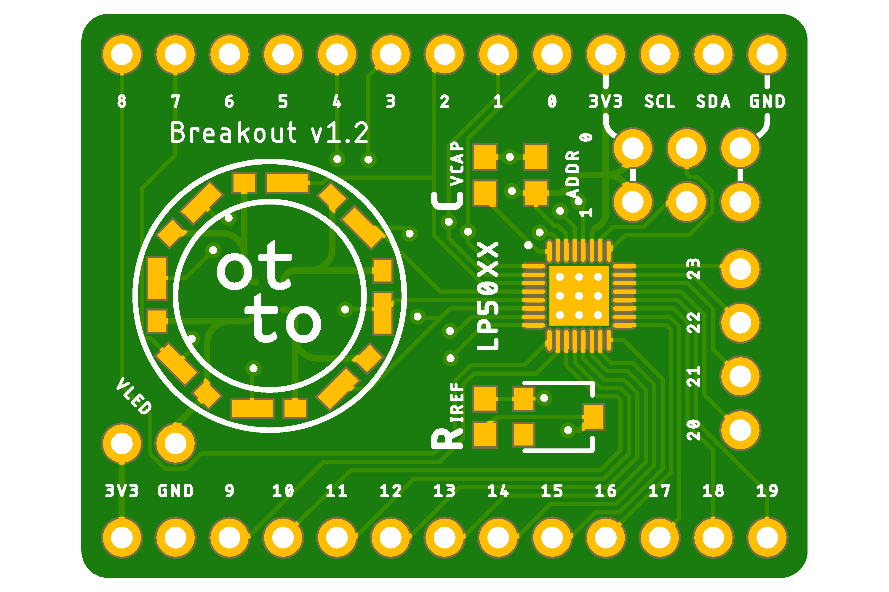

# Breakout board for LP5018 and LP5024

- Designed with Autodesk Eagle
- 2-layer board
- Builtin 0603 R_IREF and trimpot to control current, and 1uF 0603 C_VCAP.
- Uses [LP50XX Library](./lp50xx.lbr), modified [Sparkfun Libraries](https://github.com/sparkfun/SparkFun-Eagle-Libraries) and a modified pinhead library.

